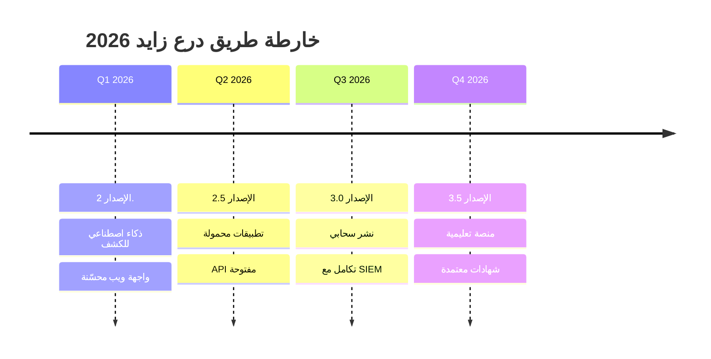

## 🛡درع زايد 
# Colors
GREEN='\033[0;32m'
BLUE='\033[0;34m'
YELLOW='\033[1;33m'
PURPLE='\033[0;35m'
NC='\033[0m'

echo -e "${PURPLE}🎨 إعداد البانرات والصور للمشروع${NC}"
echo "========================================"

# إنشاء مجلد الصور
mkdir -p resources/images/{banners,logos,screenshots,badges}

# إنشاء README.md الاحترافي
cat > README.md << 'EOF'
# 🛡 درع زايد للأمن السيبراني | Digital Genie Cybersecurity

<div align="center">
  
  
  
  ### 🚀 **مجموعة شاملة من أدوات الأمن السيبراني المتقدمة**
  
  [](https://github.com/nike1212a/digital-genie-cybersecurity/stargazers)
  [](https://github.com/nike1212a/digital-genie-cybersecurity/network)
  [](https://github.com/nike1212a/digital-genie-cybersecurity/issues)
  [](LICENSE)
  
  [](https://git.io/typing-svg)
  
  ---
  
  
  
  
</div>

## 🎯 **نبذة عن المشروع**

> 🔮 **درع زايد** هو أول مشروع أمن سيبراني شامل باللغة العربية يجمع أكثر من **100 أداة متخصصة** في مجال الأمن الرقمي.

<div align="center">
  
  
  
  
  
</div>

## ✨ **المميزات الرئيسية**

<div align="center">

<table>
<tr>
<td align="center" width="25%">

<br><strong>🔧 إعداد تلقائي</strong>
<br>سكريپت واحد يثبت كل شيء
</td>
<td align="center" width="25%">

<br><strong>🌐 أدوات الشبكة</strong>
<br>مسح وتحليل متقدم
</td>
<td align="center" width="25%">

<br><strong>🔐 الأمان المتقدم</strong>
<br>حماية وفحص الثغرات
</td>
<td align="center" width="25%">

<br><strong>📊 التحليل الجنائي</strong>
<br>استرداد وتحليل البيانات
</td>
</tr>
</table>

</div>

## 🛠️ **التقنيات المستخدمة**

<div align="center">


</div>

## 🚀 **البدء السريع**

<details>
<summary>📥 <strong>التثبيت التلقائي (موصى به)</strong></summary>

```bash
# 🚀 تثبيت سريع في خطوة واحدة
curl -fsSL https://raw.githubusercontent.com/nike1212a/digital-genie-cybersecurity/main/quick_install.sh | bash

# أو التثبيت اليدوي
git clone https://github.com/nike1212a/digital-genie-cybersecurity.git
cd digital-genie-cybersecurity
chmod +x scripts/core/setup_security_lab.sh
./scripts/core/setup_security_lab.sh
```

</details>

<details>
<summary>🐳 <strong>تشغيل باستخدام Docker</strong></summary>

```bash
# تحميل وتشغيل الحاوية
docker pull asrarmared/digital-genie:latest
docker run -it --rm -p 8080:8080 asrarmared/digital-genie:latest

# أو بناء من المصدر
docker build -t digital-genie .
docker run -it --privileged --net=host digital-genie
```

</details>

## 📊 **إحصائيات المشروع**

<div align="center">


<table>
<tr>
<td>

**📈 نمو المشروع**
- ⭐ Stars: 
- 🍴 Forks: 
- 👀 Watchers: 
- 🐛 Issues: 

</td>
<td>

**💻 تفاصيل الكود**
- 📝 Lines: 
- 📁 Size: 
- 📅 Last Commit: 
- 🔢 Version: 

</td>
</tr>
</table>

</div>

## 🛡️ **الأدوات والتقنيات**

<details>
<summary>🌐 <strong>أدوات الشبكة المتقدمة</strong></summary>

### 🔍 **مسح الشبكات**
- **Nmap** - مسح المنافذ الشامل
- **Masscan** - مسح سريع للشبكات الكبيرة
- **Zmap** - مسح الإنترنت الشامل
- **DNSEnum** - تعداد DNS متقدم

### 📡 **تحليل اللاسلكي**
- **Aircrack-ng** - كسر WEP/WPA
- **WiFi-Pumpkin** - نقطة وصول مزيفة
- **Kismet** - مراقبة الشبكات اللاسلكية
- **Reaver** - هجمات WPS

</details>

<details>
<summary>🔐 <strong>أدوات الأمان والاختراق</strong></summary>

### 💥 **كسر كلمات المرور**
- **John the Ripper** - كاسر كلمات المرور
- **Hashcat** - كاسر GPU متقدم
- **Hydra** - هجمات القاموس
- **Medusa** - اختبار تسجيل الدخول

### 🔍 **فحص الثغرات**
- **OpenVAS** - فحص الثغرات الشامل
- **Nikto** - فحص خوادم الويب
- **SQLMap** - فحص حقن SQL
- **Metasploit** - إطار عمل الاستغلال

</details>

## 🎓 **الدروس التعليمية**

<div align="center">

[](https://youtube.com/c/DigitalGenieSecurity)
[](https://udemy.com/course/digital-genie-cybersecurity)

| 📚 **الكورس** | 🎯 **المستوى** | ⏱️ **المدة** | 🌟 **التقييم** |
|:---:|:---:|:---:|:---:|
| [أساسيات الأمن السيبراني](docs/tutorials/basics.md) | مبتدئ | 4 ساعات | ⭐⭐⭐⭐⭐ |
| [اختبار الاختراق المتقدم](docs/tutorials/advanced.md) | متقدم | 8 ساعات | ⭐⭐⭐⭐⭐ |
| [الطب الشرعي الرقمي](docs/tutorials/forensics.md) | خبير | 12 ساعة | ⭐⭐⭐⭐⭐ |

</div>

## 🌍 **المجتمع والدعم**

<div align="center">

[](https://discord.gg/digital-genie)
[](https://t.me/digital_genie_security)
[](https://chat.whatsapp.com/digital-genie)
[](https://reddit.com/r/DigitalGenieSecurity)

### 👥 **احصائيات المجتمع**


</div>

## 🏆 **المساهمون الأبطال**

<div align="center">
  
  
  
  <table>
<tr>
<td align="center">

<br><strong>asrarmared</strong>
<br>🧞‍♂️ Creator & Lead Developer
</td>
<td align="center">

<br><strong>المساهم التالي</strong>
<br>🤝 قد تكون أنت!
</td>
</tr>
</table>

</div>

## 🎯 **خارطة الطريق 2025**

<div align="center">



</div>

## 🔥 **مميزات قادمة**

<div align="center">

| الميزة | الحالة | التقدم | التاريخ المتوقع |
|:---:|:---:|:---:|:---:|
| 🤖 **AI Threat Detection** | 🟡 قيد التطوير |  | فبراير 2026 |
| 📱 **Mobile Apps** | 🟡 قيد التطوير |  | مارس 2026 |
| ☁️ **Cloud Deployment** | ⚪ مخطط |  | أبريل 2026 |
| 🎓 **Learning Platform** | ⚪ مخطط |  | يونيو 2026 |

</div>

## 💰 **الدعم المالي**

<div align="center">

إذا كان هذا المشروع يفيدك، فكر في دعمنا:

[](https://paypal.me/nike1212a)
[](https://buymeacoffee.com/nike1212a)
[](https://patreon.com/nike1212a)

**⭐ أو ببساطة أعطنا نجمة على GitHub! ⭐**

</div>

## 📜 **الترخيص والإخلاء**

<div align="center">

[](https://opensource.org/licenses/MIT)

### ⚠️ **إخلاء مسؤولية مهم**

```
⚖️ هذا المشروع مخصص للأغراض التعليمية واختبار الأمان الأخلاقي فقط.
🚫 المطور غير مسؤول عن أي استخدام غير قانوني أو ضار للأدوات المتضمنة.
✅ يُرجى استخدام الأدوات بمسؤولية ووفقاً للقوانين المحلية والدولية.
📚 الهدف هو التعليم وتحسين الأمان وليس الإضرار بالآخرين.
```

</div>


<div align="center">


### 🛡 **"درع زايد في خدمة الأمن السيبراني العربي"**

**صُنع بـ ❤️ وقهوة ☕ من قِلبasrarmared](https://github.com/asrarmared)**

**2025 درع زايد للأمن السيبراني - جميع الحقوق محفوظة**

[](https://github.com/nike1212a)
[](#)
[](#)

</div>
EOF

# إنشاء ملف Profile README شخصي
cat > PROFILE_README.md << 'EOF'
# 👋 مرحباً، أنا nike1212a

<div align="center">
  
  
  
  [](https://git.io/typing-svg)
  
</div>

## 🚀 **عني**

> 🧞‍♂️ **المحارب الرقمي** - خبير أمن سيبراني ومطور برمجيات شغوف بحماية العالم الرقمي العربي

- 🔭 أعمل حالياً على **مشروع المارد الرقمي للأمن السيبراني**
- 🌱 أتعلم باستمرار **تقنيات الذكاء الاصطناعي في الأمان**
- 👯 أبحث عن التعاون في **مشاريع الأمن السيبراني مفتوحة المصدر**
- 🤔 أحتاج مساعدة في **تطوير منصة تعليمية للأمن السيبراني**
- 💬 اسألني عن **الأمن السيبراني، اختبار الاختراق، Python، Linux**
- 📫 كيفية التواصل معي: **security@digital-genie-project.com**
- ⚡ حقيقة مثيرة: **أستطيع كسر كلمة مرور في دقائق، لكنني أستغرق ساعات لتذكر كلمة مروري الشخصية! 😄**

## 🛠️ **مهاراتي التقنية**

<div align="center">

### 💻 **لغات البرمجة**


### 🔐 **أدوات الأمن السيبراني**


### ☁️ **التقنيات السحابية والأدوات**


</div>

## 📊 **إحصائياتي على GitHub**

<div align="center">
  
  
  
  
  
  
  
  
</div>

## 🏆 **إنجازاتي وشهاداتي**

<div align="center">
  
  [](https://github.com/ryo-ma/github-profile-trophy)
  
  ### 🎖️ **الشهادات المهنية**
  
  [](https://cert.eccouncil.org/)
  [](https://www.isc2.org/)
  [](https://www.offensive-security.com/)
  
</div>

## 🚀 **مشاريعي المميزة**

<div align="center">

[](https://github.com/nike1212a/digital-genie-cybersecurity)
[](https://github.com/nike1212a/security-tools-collection)

</div>

## 📈 **مساهماتي**

<div align="center">
  
  
  
</div>

## 🤝 **تواصل معي**

<div align="center">
  
  [](mailto:security@digital-genie-project.com)
  [](https://linkedin.com/in/nike49424)
  [](https://twitter.com/nike49424)
  [](https://t.me/nike49424)
  [](https://discord.gg/nike49424)
  
  ### 📊 **آخر المقالات**
  <!-- BLOG-POST-LIST:START -->
  - 🔐 [أساسيات الأمن السيبراني للمبتدئين](https://blog.digital-genie.com/cybersecurity-basics)
  - 🛡️ [كيفية حماية شبكتك المنزلية](https://blog.digital-genie.com/home-network-security)
  - 💻 [أدوات الـ Penetration Testing المجانية](https://blog.digital-genie.com/free-pentest-tools)
  <!-- BLOG-POST-LIST:END -->
  
</div>

## 💝 **دعم عملي**

<div align="center">
  
  إذا كنت تستفيد من مشاريعي، فكر في دعمي:
  
  [](https://paypal.me/nike1212a)
  [](https://buymeacoffee.com/nike1212a)
  
  **⭐ أو أعطني نجمة على مشاريعي! ⭐**
  
</div>

## 📊 **معلومات إضافية**

<div align="center">


**🕐 مناطقي الزمنية**: GMT+3 (الرياض)  
**💻 أنظمة التشغيل المفضلة**: Kali Linux, Ubuntu, Arch Linux  
**☕ المشروب المفضل**: قهوة عربية أصيلة  
**🎯 هدفي**: جعل الإنترنت مكاناً أكثر أماناً للجميع

</div>

<div align="center">
  
  
  
  **"الأمان ليس مجرد تقنية، بل فلسفة حياة"** 🧞‍♂️
  
</div>
EOF

echo -e "${GREEN}✅ تم إنشاء ملفات README الاحترافية${NC}"
echo -e "${BLUE}📄 الملفات المُنشأة:${NC}"
echo "  • README.md - الصفحة الرئيسية للمشروع"
echo "  • PROFILE_README.md - الملف الشخصي"

# إنشاء دليل الأسلوب للصور
cat > IMAGE_GUIDE.md << 'EOF'
# 🎨 دليل الصور والبانرات

## 📸 **أنواع الصور المطلوبة**

### 1. **البانر الرئيسي**
- الأبعاد: 1200x400 بكسل
- التصميم: تدرج لوني مع شعار المشروع
- النص: "المارد الرقمي للأمن السيبراني"
- الألوان: أزرق داكن إلى بنفسجي

### 2. **أيقونات الأدوات**
- الأبعاد: 64x64 بكسل
- التنسيق: PNG بخلفية شفافة
- الأسلوب: مسطح مع ظلال خفيفة

### 3. **لقطات الشاشة**
- الجودة: عالية الدقة
- التأطير: مع حدود ملونة
- العلامة المائية: شعار المشروع في الزاوية

## 🔧 **أدوات التصميم المقترحة**

### مجاني:
- **GIMP** - محرر صور متقدم
- **Canva** - تصميم سهل وسريع  
- **Figma** - تصميم واجهات المستخدم

### مدفوع:
- **Adobe Photoshop** - محرر صور احترافي
- **Adobe Illustrator** - تصميم شعارات
- **Sketch** - تصميم واجهات (Mac فقط)

## 🌐 **مصادر الصور المجانية**

### أيقونات:
- https://icons8.com - آلاف الأيقونات المجانية
- https://flaticon.com - أيقونات مسطحة
- https://fontawesome.com - أيقونات ويب

### صور خلفية:
- https://unsplash.com - صور عالية الجودة
- https://pexels.com - صور مجانية
- https://pixabay.com - صور وفيديوهات

### تدرجات لونية:
- https://uigradients.com - تدرجات جاهزة
- https://webgradients.com - 180 تدرج مجاني
- https://coolors.co - مولد ألوان

## 📐 **معايير التصميم**

### الألوان الرئيسية:
```
الأزرق الداكن: #1a1a2e
البنفسجي: #6c5ce7
الوردي: #fd79a8
الأخضر: #00b894
الذهبي: #fdcb6e
```

### الخطوط المستخدمة:
- **العربية**: Cairo, IBM Plex Sans Arabic, Tajawal
- **الإنجليزية**: Roboto, Poppins, Inter, Fira Code

## 🎯 **قائمة المهام**

- [ ] إنشاء بانر رئيسي 1200x400
- [ ] تصميم شعار 512x512
- [ ] التقاط 10 لقطات شاشة
- [ ] إنشاء 20 أيقونة للأدوات
- [ ] تصميم بانر للـ GitHub Profile
- [ ] إنشاء صور للشبكات الاجتماعية
- [ ] تصميم أزرار وشارات مخصصة

## 🚀 **نصائح التصميم**

1. **البساطة**: تصاميم بسيطة وواضحة
2. **التناسق**: استخدم نفس الألوان والأسلوب
3. **الوضوح**: نص واضح وسهل القراءة
4. **الاحترافية**: جودة عالية وتفاصيل دقيقة
5. **العلامة التجارية**: شعار ظاهر في كل تصميم
EOF

echo -e "${GREEN}✅ تم إنشاء دليل الصور${NC}"

# إنشاء سكريبت للتحميل السريع
cat > quick_upload.sh << 'UPLOADSCRIPT'
#!/bin/bash

# سكريبت التحميل السريع على GitHub

echo "🚀 تحضير المشروع للرفع على GitHub..."

# تهيئة Git
git init
git add .
git commit -m "🎉 الإطلاق الأول: درع زايد للأمن السيبراني v1.0

✨ المميزات الرئيسية:
- 🔧 سكريبت إعداد تلقائي شامل
- 🌐 أدوات شبكة متقدمة
- 🔐 أدوات أمان متخصصة
- 📊 نظام الطب الشرعي الرقمي
- 🤖 أتمتة وتقارير ذكية
- 🛡️ نظام حماية متقدم
- 📚 وثائق شاملة باللغة العربية

🎯 المشروع الأول والأشمل للأمن السيبراني باللغة العربية!"

# إضافة Remote
echo ""
echo "📡 إضافة المستودع البعيد..."
read -p "أدخل رابط المستودع (مثال: https://github.com/asrarmared/Zayed-Shield-.git): " REPO_URL

if [ -z "$REPO_URL" ]; then
    echo "❌ يجب إدخال رابط المستودع!"
    exit 1
fi

git remote add origin "$REPO_URL"

# إنشاء الفروع
echo ""
echo "🌿 إنشاء الفروع..."
git branch -M main
git branch develop

# رفع الملفات
echo ""
echo "⬆️ رفع الملفات إلى GitHub..."
git push -u origin main

echo ""
echo "✅ تم رفع المشروع بنجاح!"
echo ""
echo "🎉 المشروع الآن متاح على GitHub!"
echo "🔗 الرابط: $REPO_URL"
echo ""
echo "📋 الخطوات التالية:"
echo "  1. افتح المستودع في المتصفح"
echo "  2. أضف وصف للمشروع"
echo "  3. أضف مواضيع (Topics): cybersecurity, security-tools, arabic, pentesting"
echo "  4. فعّل GitHub Pages إذا كنت تريد موقع ويب"
echo "  5. قم بإنشاء Release للإصدار الأول"
echo ""
echo "🌟 لا تنسى مشاركة المشروع مع المجتمع!"
UPLOADSCRIPT

chmod +x quick_upload.sh

echo -e "${GREEN}✅ تم إنشاء سكريبت التحميل السريع${NC}"

# إنشاء ملف GitHub Actions للـ CI/CD
mkdir -p .github/workflows

cat > .github/workflows/ci.yml << 'CIFILE'
name: 🧞‍♂️ Digital Genie CI/CD

on:
  push:
    branches: [ main, develop ]
  pull_request:
    branches: [ main ]

jobs:
  test:
    name: 🧪 Test Scripts
    runs-on: ubuntu-latest
    
    steps:
    - name: 📥 Checkout code
      uses: actions/checkout@v3
      
    - name: 🐍 Setup Python
      uses: actions/setup-python@v4
      with:
        python-version: '3.11'
        
    - name: 📦 Install dependencies
      run: |
        pip install -r requirements.txt
        
    - name: 🧪 Run tests
      run: |
        python -m pytest tests/
        
    - name: 🔍 Lint code
      run: |
        pip install pylint
        pylint scripts/**/*.py

  security-scan:
    name: 🔐 Security Scan
    runs-on: ubuntu-latest
    
    steps:
    - name: 📥 Checkout code
      uses: actions/checkout@v3
      
    - name: 🔒 Run Trivy vulnerability scanner
      uses: aquasecurity/trivy-action@master
      with:
        scan-type: 'fs'
        scan-ref: '.'
        
    - name: 🛡️ Run security audit
      run: |
        pip install safety
        safety check

  build:
    name: 🏗️ Build & Deploy
    needs: [test, security-scan]
    runs-on: ubuntu-latest
    if: github.ref == 'refs/heads/main'
    
    steps:
    - name: 📥 Checkout code
      uses: actions/checkout@v3
      
    - name: 🐳 Build Docker image
      run: |
        docker build -t digital-genie:latest .
        
    - name: 📤 Push to Docker Hub
      if: success()
      run: |
        echo "${{ secrets.DOCKER_PASSWORD }}" | docker login -u "${{ secrets.DOCKER_USERNAME }}" --password-stdin
        docker tag digital-genie:latest asrarmared/digital-genie:latest
        docker push asrarmared/digital-genie:latest
CIFILE

echo -e "${GREEN}✅ تم إنشاء ملف GitHub Actions${NC}"

# إنشاء قوالب Issue
cat > .github/ISSUE_TEMPLATE/bug_report.md << 'BUGTEMPLATE'
---
name: 🐛 تقرير خطأ
about: أبلغ عن خطأ لمساعدتنا في التحسين
title: '[BUG] '
labels: 'bug'
assignees: 'asrarmared 
---

## 🐛 وصف الخطأ
وصف واضح وموجز للخطأ.

## 📝 خطوات إعادة الإنتاج
1. اذهب إلى '...'
2. انقر على '....'
3. قم بالتمرير إلى '....'
4. لاحظ الخطأ

## ✅ السلوك المتوقع
وصف واضح وموجز لما كنت تتوقع حدوثه.

## 📸 لقطات الشاشة
إذا كان ذلك ممكناً، أضف لقطات شاشة لشرح المشكلة.

## 💻 معلومات النظام
- نظام التشغيل: [مثال: Ubuntu 22.04]
- نسخة Python: [مثال: 3.11]
- نسخة المشروع: [مثال: v1.0]

## 📋 معلومات إضافية
أي معلومات إضافية عن المشكلة.
BUGTEMPLATE

cat > .github/ISSUE_TEMPLATE/feature_request.md << 'FEATURETEMPLATE'
---
name: ✨ طلب ميزة
about: اقترح ميزة جديدة للمشروع
title: '[FEATURE] '
labels: 'enhancement'
assignees: 'nike1212a'
---

## 🎯 وصف الميزة
وصف واضح وموجز للميزة المقترحة.

## 💡 لماذا هذه الميزة مهمة؟
اشرح كيف ستفيد هذه الميزة المشروع والمستخدمين.

## 🔧 الحل المقترح
وصف واضح لكيفية تنفيذ الميزة.

## 🌟 البدائل المدروسة
صف أي حلول أو ميزات بديلة فكرت فيها.

## 📋 معلومات إضافية
أي معلومات أخرى أو لقطات شاشة حول طلب الميزة.
FEATURETEMPLATE

cat > .github/PULL_REQUEST_TEMPLATE.md << 'PRTEMPLATE'
## 📝 وصف التغييرات

يرجى وصف التغييرات التي قمت بها.

## 🎯 نوع التغيير

- [ ] 🐛 إصلاح خطأ (تغيير غير عاجل يصلح مشكلة)
- [ ] ✨ ميزة جديدة (تغيير غير عاجل يضيف وظيفة)
- [ ] 💥 تغيير عاجل (إصلاح أو ميزة قد تسبب عدم عمل الوظائف الموجودة)
- [ ] 📚 تحديث الوثائق
- [ ] 🎨 تحسينات في الأسلوب/التنسيق
- [ ] ♻️ إعادة هيكلة الكود
- [ ] ⚡ تحسين الأداء
- [ ] ✅ إضافة اختبارات

## 🧪 كيف تم الاختبار؟

صف الاختبارات التي أجريتها للتحقق من تغييراتك.

- [ ] Test A
- [ ] Test B

## ✅ قائمة التحقق

- [ ] الكود يتبع معايير المشروع
- [ ] قمت بمراجعة الكود الخاص بي
- [ ] قمت بإضافة/تحديث الوثائق
- [ ] قمت بإضافة اختبارات
- [ ] جميع الاختبارات تعمل بنجاح
- [ ] التغييرات لا تنتج تحذيرات جديدة

## 📸 لقطات الشاشة (إن وجدت)

## 📋 ملاحظات إضافية
PRTEMPLATE

echo -e "${GREEN}✅ تم إنشاء قوالب GitHub${NC}"

# إنشاء ملف لنص النشر الترويجي
cat > SOCIAL_MEDIA_POST.md << 'SOCIALPOST'
# 📱 منشورات وسائل التواصل الاجتماعي

## 🐦 Twitter / X

```
🛡 أطلقنا للتو "درع زايد للأمن السيبراني"!

🎯 أول مشروع أمن سيبراني شامل باللغة العربية
🔧 100+ أداة متخصصة
🌐 واجهة عربية سهلة
📚 وثائق شاملة
🆓 مفتوح المصدر بالكامل

⭐ GitHub: https://github.com/nike1212a/digital-genie-cybersecurity

#الأمن_السيبراني #CyberSecurity #OpenSource #عربي
```

## 📘 Facebook / LinkedIn

```
🎉 إطلاق "درع زايد للأمن السيبراني" 🛡

نفخر بالإعلان عن إطلاق أول مشروع أمن سيبراني شامل باللغة العربية! 🚀

✨ ما الذي يجعله مميزاً؟

🔐 أكثر من 100 أداة متخصصة في الأمن السيبراني
🌐 أدوات شبكة متقدمة للمسح والتحليل
🛡️ أدوات أمان واختبار اختراق أخلاقي
📊 نظام الطب الشرعي الرقمي الكامل
🤖 أتمتة ذكية وتقارير احترافية
🐳 دعم Docker والبيئات السحابية
📱 تطبيقات محمولة قريباً
📚 وثائق شاملة ودروس تعليمية

🎯 الهدف: جعل الأمن السيبراني متاحاً للجميع باللغة العربية

⭐ المشروع مفتوح المصدر بالكامل:
https://github.com/nike1212a/digital-genie-cybersecurity

🤝 نرحب بمساهماتكم واقتراحاتكم!

#الأمن_السيبراني #CyberSecurity #OpenSource #تطوير_البرمجيات #العالم_العربي #اختبار_الاختراق #PenetrationTesting #تكنولوجيا #برمجة
```

## 💬 WhatsApp / Telegram

```
🛡 درع زايد للأمن السيبراني

أطلقنا أول مشروع أمن سيبراني شامل بالعربية! 🚀

🎁 مجاناً ومفتوح المصدر
🔧 100+ أداة احترافية
📚 وثائق شاملة بالعربية
🎓 مناسب للمبتدئين والخبراء

⬇️ حمّله الآن:
https://github.com/asrarmared/digital-genie-cybersecurity

⭐ أعطنا نجمة على GitHub!
```

## 📸 Instagram Post Caption

```
🛡 درع زايد في خدمة الأمن السيبراني العربي

أطلقنا مشروع شامل للأمن السيبراني باللغة العربية 🚀

✨ المميزات:
• 100+ أداة احترافية 🔧
• واجهة عربية سهلة 🌐
• مفتوح المصدر 🆓
• وثائق شاملة 📚

رابط في البايو 👆

#الأمن_السيبراني #CyberSecurity #تكنولوجيا #برمجة #عربي #تطوير #هاكر_أخلاقي #أمان #الإنترنت #حماية #البيانات
```

## 🎥 YouTube Video Description

```
🛡 درع زايد للأمن السيبراني - الإطلاق الرسمي

في هذا الفيديو نستعرض مشروع "المارد الرقمي"، أول مشروع أمن سيبراني شامل باللغة العربية!

📋 محتوى الفيديو:
00:00 - مقدمة ونبذة عن المشروع
02:30 - المميزات الرئيسية
05:00 - كيفية التثبيت
10:00 - جولة في الأدوات
15:00 - أمثلة عملية
20:00 - خارطة الطريق والمستقبل

🔗 روابط مهمة:
• GitHub: https://github.com/asrarmared/digital-genie-cybersecurity
• الوثائق: https://docs.digital-genie.com
• Discord: https://discord.gg/digital-genie
• Telegram: https://t.me/digital_genie_security

📚 الفصول:
[00:00] المقدمة
[02:30] المميزات
[05:00] التثبيت
[10:00] الأدوات
[15:00] أمثلة عملية
[20:00] المستقبل

🔔 اشترك في القناة وفعّل الجرس للمزيد من محتوى الأمن السيبراني!

#الأمن_السيبراني #CyberSecurity #تكنولوجيا #برمجة #عربي
```

## 📧 Email Newsletter

```
الموضوع: 🛡 أطلقنا "درع زايد للأمن السيبراني"!

مرحباً،

يسرنا الإعلان عن إطلاق "درع زايد للأمن السيبراني"، أول مشروع أمن سيبراني شامل باللغة العربية!

🎯 ما هو درع زايد ؟
مجموعة شاملة من أدوات الأمن السيبراني المتقدمة، مصممة خصيصاً للمجتمع العربي.

✨ المميزات:
• أكثر من 100 أداة متخصصة
• واجهة عربية سهلة الاستخدام
• وثائق شاملة ودروس تعليمية
• مفتوح المصدر بالكامل
• دعم مستمر من المجتمع

🚀 ابدأ الآن:
https://github.com/asrarmared/digital-genie-cybersecurity

🤝 انضم للمجتمع:
• Discord: [@nike49424]
• Telegram:[@nike49424]
• Twitter: [@nike49424]

نتطلع لرؤية مساهماتكم!

مع أطيب التحيات،
فريق المحارب الرقمي
```
SOCIALPOST

echo -e "${GREEN}✅ تم إنشاء محتوى وسائل التواصل${NC}"

echo ""
echo -e "${PURPLE}========================================${NC}"
echo -e "${GREEN}✅ اكتمل الإعداد بنجاح!${NC}"
echo -e "${PURPLE}========================================${NC}"
echo ""
echo -e "${YELLOW}📁 الملفات المُنشأة:${NC}"

echo "  ✅ README.md - الصفحة الرئيسية المحترفة"

echo "  ✅ PROFILE_README.md - الملف الشخصي"

echo "  ✅ IMAGE_GUIDE.md - دليل الصور والتصميم"

echo "  ✅ quick_upload.sh - سكريپت الرفع السريع"

echo "  ✅ .github/workflows/ci.yml - التكامل المستمر"

echo "  ✅ .github/ISSUE_TEMPLATE/ - قوالب الـ Issues"

echo "  ✅ .github/PULL_REQUEST_TEMPLATE.md - قالب الـ PR"

echo "  ✅ SOCIAL_MEDIA_POST.md - محتوى الترويج"

echo -e "${CYAN}🚀 الخطوات التالية:${NC}"

echo "  1. راجع ملف README.md وعدّله حسب الحاجة"

echo "  2. صمم الصور والبانرات (راجع IMAGE_GUIDE.md)"

echo "  3. شغّل: ./quick_upload.sh لرفع المشروع"

echo "  4. روّج للمشروع (راجع SOCIAL_MEDIA_POST.md)"

echo -e "${GREEN}🎉 مشروعك جاهز للإطلاق!${NC}"
